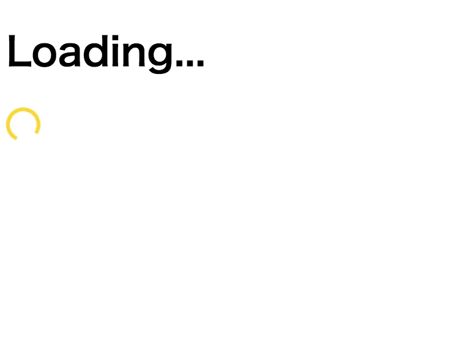

# Example: Server-Side rendering

An example of spinner in Server-Side Rendering.



## Example

The point is to use `ssrBehavior`.

```javascript
import { ssrBehavior } from "react-md-spinner";

const html = (root: JSX.Element) => `<html lang="en">
  <head>
    <meta charset="utf-8">
    <meta http-equiv="X-UA-Compatible" content="IE=edge">
    ${ssrBehavior.getStylesheetString()}
  </head>
  <body>
    <div id="app">${renderToString(root)}</div>
    <script defer src="/client.js"></script>
  </body>
</html>`;

app.get("/", (_req, res) => {
  res.status(200).send(`<!doctype html>${renderer(<App />)}`);
});
```

### App

```javascript
import React, { useState, useEffect } from "react";
import MDSpinner from "react-md-spinner";

export const App: React.FC = () => {
  const [mounted, setMounted] = useState(false);

  useEffect(() => {
    setMounted(true);
  }, []);

  return (
    <div>
      <h1>{mounted ? "Mounted" : "Loading..."}</h1>
      <MDSpinner />
    </div>
  );
};
```

## Available Scripts

In the project directory, you can run:

### `$ npm start`

Runs the app.  
Open http://localhost:8080 to view it in the browser.

### `$ npm run build`

Build the client side and server side code.
